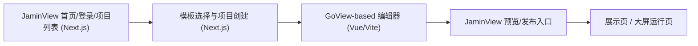

# JaminView 基于 GoView 的编辑器接管迁移方案 V1

这份文档只回答一个问题：

> JaminView 现在的编辑器做得不够像真正可用的大屏编辑器，是否应该直接接管 GoView，以及应该怎么接管。

本文件不是功能愿景文档，而是实施决策文档。目标是让团队在继续开发前，先把路线选对。

---

## 1. 结论先行

当前我给出的明确结论是：

- **不要继续在现有 JaminView 编辑器上做修修补补式重构**
- **优先采用 GoView 的成熟编辑器能力作为基础**
- **JaminView 保留自己的产品壳、品牌样式、项目流和发布流**
- **编辑器部分建议走“接管式迁移”**

一句话版本：

> **JaminView 应该把 GoView 当成编辑器内核来接管，而不是继续把当前这套 React 编辑器一点点补成 GoView。**

---

## 2. 为什么要改路线

当前 JaminView 这套编辑器存在的核心问题，不是“少几个功能”，而是：

1. 编辑器核心模型还不成熟
- 右侧面板结构不稳定
- 不同组件的编辑边界不够清楚
- 页面级、组件级、数据级能力经常混在一起

2. 组件池和组件模型不够像真实大屏产品
- 组件种类不够系统
- 装饰组件、数字翻牌、地图、表格、请求配置、事件配置，更多像“补功能”
- 不像成熟编辑器那种原生就存在的模块

3. 继续自己补，成本高且风险大
- 现在已经能看到：每加一个能力，都要同时补 UI、数据模型、运行时、预览态、发布态
- 如果继续走“现有 React 编辑器逐步补齐”的路线，会长期陷入高返工

4. GoView 已经验证了这类产品路线
- 它公开展示并在源码里明确存在：
  - 工作台
  - 全局控制
  - 组件基础配置
  - 请求配置
  - 数据过滤
  - 高级事件编辑
  - 丰富组件池

所以，当前最需要的不是继续“发明编辑器”，而是：

> **接管一个已经有成熟编辑器结构的项目，再把它变成 JaminView。**

---

## 3. 研究基础

这次判断不是拍脑袋，基于以下已经确认的事实：

### 3.1 GoView 许可证

- GoView 为 `MIT License`
- 可以合法地使用、修改、合并和再发布

来源：
- `/tmp/goview-ref/LICENSE`
- `/tmp/goview-ref/README.md`

### 3.2 GoView 技术栈

GoView 当前主前端栈为：

- `Vue3`
- `TypeScript`
- `Vite`
- `NaiveUI`
- `Pinia`
- `ECharts`
- `VChart`

来源：
- `/tmp/goview-ref/package.json`
- `/tmp/goview-ref/README.md`

### 3.3 JaminView 当前技术栈

JaminView 当前主前端栈为：

- `Next.js`
- `React`
- `TypeScript`
- `Tailwind`
- `next-intl`
- `@visactor/react-vchart`
- `@dnd-kit/core`

来源：
- `/Users/admin/Documents/jaminview/package.json`

### 3.4 关键结论

这意味着：

- **不能把 GoView 代码无痛拷进当前 JaminView 编辑器目录里**
- **也不适合继续把 GoView 功能逐项翻译到 React 现有实现上**

最现实的路径是：

> **把 GoView 作为独立编辑器应用接管，再和 JaminView 外层产品壳打通。**

---

## 4. GoView 里值得直接接管的能力

以下内容不建议重新发明，建议直接接管或高度复用其结构：

### 4.1 编辑器整体结构

- 顶部编辑工具栏
- 左侧组件池 / 图层区
- 中间画布
- 右侧属性配置区
- 预览机制

### 4.2 数据层能力

- 请求配置
- 数据池 / 数据源
- 数据过滤
- 数据映射
- 组件级数据处理

### 4.3 组件池

- 柱状图
- 横向柱状图
- 折线图
- 面积图
- 饼图 / 环图
- 文字
- 图片
- 滚动排名列表
- 滚动表格
- 边框装饰
- 装饰组件
- 数字翻牌
- 时间类

### 4.4 运行时能力

- 高级事件
- 点击事件
- 联动
- 预览页 / 展示页运行模型

### 4.5 大屏常用视觉语言

- 装饰边框
- 发光组件
- 时间和数字组件
- 大屏成品感结构

---

## 5. 哪些东西不能直接照搬

虽然建议接管 GoView，但不是所有东西都照搬：

### 5.1 品牌与视觉

必须替换为 JaminView 的：

- Logo
- 品牌名
- 绿色主色 + 燕麦色/浅中性色系统
- 首页与工作台语言
- 登录态和项目态视觉

### 5.2 产品流程

JaminView 仍然要保留自己的产品流：

- 首页
- 项目列表
- 模板选择
- 数据导入
- 编辑
- 预览
- 发布
- 展示

GoView 更像“编辑器平台”，JaminView 还需要自己的“产品壳”。

### 5.3 第一版不需要照搬的深功能

可以先不全接：

- 多人协作
- 复杂动画时间轴
- 特别深的脚本系统
- 复杂联动编排
- 企业级权限系统

---

## 6. 三条可选路线

### 路线 A：继续基于当前 JaminView 编辑器重构

#### 做法

- 保留当前 Next.js/React 编辑器
- 继续按 GoView / DataV 思路重构右侧面板、组件池、数据系统

#### 优点

- 不需要双栈
- 全部都在一个工程里

#### 缺点

- 成本最高
- 风险最高
- 过去已经证明效率低、返工重
- 很容易继续做成“像编辑器的产品原型”

#### 结论

- **不推荐**

---

### 路线 B：直接 Fork GoView，作为 JaminView 编辑器应用

#### 做法

- 新建 `jaminview-editor`（或作为仓库内子目录/子应用）
- 以 GoView 为编辑器基础
- 先替换品牌、主题和默认组件
- 再把 JaminView 的项目流和发布流接进去

#### 优点

- 最快获得成熟编辑器能力
- 功能丰富度最高
- 最接近你想要的“像 GoView / DataV”

#### 缺点

- 双技术栈：
  - JaminView 外层是 React/Next
  - 编辑器内核是 Vue/Vite
- 需要处理项目数据协议和整合方式

#### 结论

- **强烈推荐**

---

### 路线 C：JaminView 保留外层产品壳，GoView 独立接管编辑器

#### 做法

- `JaminView` 继续负责：
  - 首页
  - 登录
  - 项目列表
  - 模板选择
  - 发布结果页
- `GoView-based Editor` 负责：
  - 编辑器
  - 数据配置
  - 请求配置
  - 装饰组件
  - 大屏运行时
- 两边通过统一数据协议和项目 ID 打通

#### 优点

- 风险最平衡
- 外层产品仍保留 JaminView 自己的风格和节奏
- 编辑器直接获得成熟能力
- 后续可以渐进整合，而不是一次性重写

#### 缺点

- 工程整合复杂度略高于单应用
- 需要设计清晰的数据协议

#### 结论

- **最推荐的实施路线**

---

## 7. 推荐路线

当前建议正式采用：

> **路线 C：JaminView 保留外层产品壳，GoView 独立接管编辑器**

原因：

1. 你最在意的是编辑器必须像真正可用的 GoView / DataV  
   这点当前 React 编辑器很难在短期内追上。

2. 你又不只是要一个编辑器站点  
   还要 JaminView 的品牌、首页、项目流和产品包装。

3. 路线 C 能兼顾：
- 产品外壳属于 JaminView
- 编辑器能力来自 GoView

---

## 8. 迁移后的目标架构

### 8.1 JaminView 外层继续负责

- 首页
- 登录
- 项目列表
- 模板选择
- 项目元数据
- 发布入口和展示链接

### 8.2 GoView 编辑器负责

- 页面编辑
- 组件拖拽
- 数据接入
- 请求配置
- 数据过滤
- 高级事件
- 图表 / 地图 / 装饰组件

### 8.3 两边共享的协议

需要定义：

- `projectId`
- `templateId`
- `screenConfig`
- `widgetTree`
- `datasetConfig`
- `publishedSnapshot`

---

## 9. 分阶段实施

### Phase 0：冻结现有编辑器继续扩展

目标：

- 不再继续给当前 React 编辑器堆大功能
- 只保留必要修 bug 和展示

输出：

- 当前编辑器转为过渡版本

### Phase 1：搭 GoView 接管验证环境

目标：

- 跑通 GoView 本地工程
- 识别需要替换的品牌点
- 识别核心模块入口：
  - 工作台
  - 编辑页
  - 预览页
  - 请求配置
  - 组件池

验收：

- 能本地启动 GoView
- 能清楚定位要改的主要界面

### Phase 2：视觉接管

目标：

- 替换 GoView 品牌为 JaminView
- 改主题色
- 改亮白/浅色风格
- 改登录/工作台/编辑器头部语言

验收：

- 一眼看上去是 JaminView，不是原版 GoView

### Phase 3：产品流接管

目标：

- 让 JaminView 项目列表和模板选择能进入 GoView 编辑器
- 打通项目 ID、模板 ID、草稿保存

验收：

- 能从 JaminView 创建项目并进入编辑器

### Phase 4：发布链路接管

目标：

- 接管预览
- 接管发布
- 接管展示页

验收：

- `项目 -> 编辑 -> 预览 -> 发布 -> 展示` 链路稳定

### Phase 5：组件池裁剪与增强

目标：

- 保留我们真正需要的组件
- 删掉短期用不到的组件
- 增加 JaminView 专属模板和默认组件风格

---

## 10. 必须先改的地方

如果采用 GoView 接管，优先要改的不是图表，而是这些：

1. 项目与路由入口
2. 品牌与主题
3. 编辑器顶部工具栏语言
4. 组件池默认分类
5. 数据保存和项目归属

---

## 11. 风险

### 11.1 双技术栈风险

当前最大风险不是功能，而是工程：

- JaminView：`Next.js + React`
- GoView：`Vue3 + Vite + NaiveUI`

这意味着团队要接受：

- 编辑器和外层产品不是同栈
- 后期如果强行统一，成本会高

### 11.2 集成复杂度

需要额外设计：

- 项目数据协议
- 草稿和发布快照的存储位置
- 登录态或项目归属的一致性

### 11.3 UI 一致性

如果只换 logo，不改主题和细节，会变成“壳是 JaminView，编辑器还是 GoView”。

所以视觉接管必须认真做，不能只做半套。

---

## 12. 当前拍板建议

当前建议正式采用：

1. **停止继续重构现有 React 编辑器为 GoView 替代品**
2. **新开 GoView 接管分支/工程**
3. **先做品牌和入口接管，再做项目流接管**

也就是说，下一步不该再是：

- 继续补当前右侧面板
- 继续补当前装饰组件
- 继续补当前图表 preset

而应该是：

> **启动 GoView 接管实施。**

---

## 13. 下一步动作

如果本方案确认，后续顺序固定为：

1. 建立 `GoView 接管任务清单`
2. 跑通 GoView 本地工程
3. 输出 `品牌替换清单`
4. 输出 `项目流接入清单`
5. 再开始真正改代码

