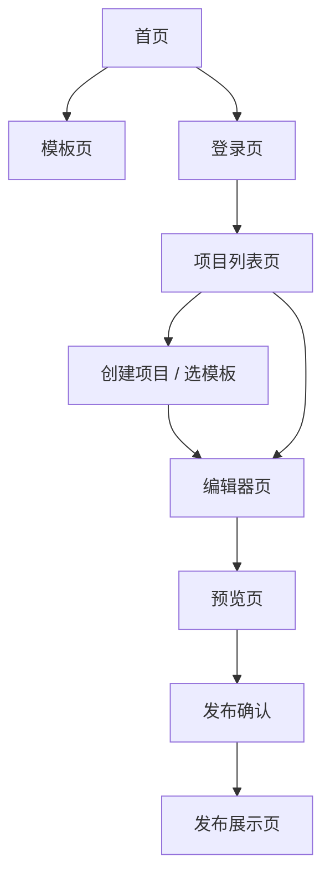

# vPro Product Wireframe Spec

## 1. 文档目标

这份文档用于定义 `vPro V1` 的页面清单与低保真原型。

它的作用不是代替最终高保真设计稿，而是先回答这几个关键问题：

- 第一版到底要有哪些页面
- 用户从首页进入后会经过哪些关键路径
- 每个页面最基本的结构长什么样
- 哪些是正式页面，哪些只是弹窗 / 抽屉 / 面板

这份文档适合作为：

- 产品原型母稿
- 设计师继续出稿的基础
- 前端开发拆页面的依据
- 团队对齐页面范围的基线

---

## 2. 原型使用原则

当前原型是 `低保真结构原型`，目标是先定：

- 信息架构
- 交互关系
- 页面区块
- 操作流

当前还不在这份文档里解决：

- 最终视觉风格
- 精细动效
- 最终品牌文案
- 组件像素级设计

---

## 3. V1 页面清单

## 3.1 P0 正式页面

第一版建议至少包含以下 8 个正式页面：

1. 首页 `/`
2. 模板页 `/templates`
3. 登录页 `/auth/sign-in`
4. 项目列表页 `/dashboard/projects`
5. 编辑器页 `/editor/[projectId]`
6. 预览页 `/preview/[projectId]`
7. 发布展示页 `/screen/[slug]`
8. 404 / 空状态兜底页

## 3.2 P0 关键弹层与子流程

虽然不是独立页面，但它们在产品体验里非常重要：

1. 创建项目弹窗 / 抽屉
2. 模板选择弹窗 / 独立步骤页
3. 数据导入弹窗
4. 发布确认弹窗
5. 发布成功反馈弹窗
6. 删除项目确认弹窗

## 3.3 P1 可后置页面

这些页面不一定要第一批就做完：

1. 模板详情页
2. 个人设置页
3. 帮助 / 文档页
4. 案例展示页

---

## 4. 页面总流程



---

## 5. 各页面低保真原型

## 5.1 首页

### 页面目标

- 讲清楚产品是什么
- 讲清楚适合谁
- 展示模板化大屏平台的当前能力
- 引导用户进入演示或浏览模板

### 页面结构

```text
+----------------------------------------------------------------------------------+
| Header: Logo | 产品能力 | 模板 | 进入演示 | 登录                                 |
+----------------------------------------------------------------------------------+
| Hero                                                                       CTA  |
| 大标题                                                                      按钮 |
| 副标题                                                                      按钮 |
| 简短说明                                                                           |
|                                           右侧主视觉 / 产品预览 / 图表装饰         |
+----------------------------------------------------------------------------------+
| 核心能力区: 模板创建 | 数据导入 | 可视化编辑 | 发布展示                           |
+----------------------------------------------------------------------------------+
| 模板展示区: 3-6 个模板卡片                                                      |
+----------------------------------------------------------------------------------+
| 工作流说明区: 选模板 -> 导入数据 -> 调整 -> 发布                                |
+----------------------------------------------------------------------------------+
| 场景区: 运营大屏 / 门店大屏 / 销售大屏 / 展会演示                                |
+----------------------------------------------------------------------------------+
| CTA 区: 进入演示 / 浏览模板                                                     |
+----------------------------------------------------------------------------------+
| Footer                                                                         |
+----------------------------------------------------------------------------------+
```

### 说明

- 首页不承担复杂产品说明书角色
- 不要提前承诺 AI 能力
- 产品截图区必须逐步换成真实产品素材

---

## 5.2 模板页

### 页面目标

- 让用户快速理解模板能力
- 让用户找到适合自己的起步模板
- 为“创建项目”提供明确入口

### 页面结构

```text
+----------------------------------------------------------------------------------+
| Header                                                                          |
+----------------------------------------------------------------------------------+
| 页面标题 + 简要说明                                                              |
+----------------------------------------------------------------------------------+
| 分类筛选: 全部 | 运营 | 销售 | 门店 | 综合总览                                 |
+----------------------------------------------------------------------------------+
| 模板网格                                                                       |
| [模板卡] [模板卡] [模板卡]                                                       |
| [模板卡] [模板卡] [模板卡]                                                       |
+----------------------------------------------------------------------------------+
| 模板卡内容: 缩略图 / 名称 / 场景标签 / 说明 / 使用此模板                         |
+----------------------------------------------------------------------------------+
| 底部 CTA                                                                        |
+----------------------------------------------------------------------------------+
```

### 说明

- 如果模板还不多，可以先只做一个简洁模板库页
- 不必第一版就做复杂模板详情页

---

## 5.3 登录页

### 页面目标

- 提供简单演示登录入口
- 把用户顺滑导向项目列表

### 页面结构

```text
+--------------------------------------------------------------+
| 左侧品牌区 / 简短介绍     | 右侧登录卡片                     |
| 产品一句话说明            | 邮箱输入                         |
| 模板截图或视觉辅助图      | 密码输入                         |
|                           | 登录按钮                         |
|                           | 演示账号说明                     |
+--------------------------------------------------------------+
```

### 说明

- 第一版是 mock 登录
- 但 UI 仍然要像正式产品，而不是测试页

---

## 5.4 项目列表页

### 页面目标

- 承接登录后的主工作台
- 展示已有项目
- 提供创建、复制、删除入口

### 页面结构

```text
+----------------------------------------------------------------------------------+
| Top Bar: Logo | 项目 | 模板 | 账号                                               |
+----------------------------------------------------------------------------------+
| 页面标题: 我的项目                                        [新建项目]            |
+----------------------------------------------------------------------------------+
| 筛选 / 搜索 / 排序                                                                |
+----------------------------------------------------------------------------------+
| 项目卡片区 / 列表区                                                              |
| [项目卡] [项目卡] [项目卡]                                                       |
| 每张卡显示: 缩略图 / 名称 / 模板来源 / 更新时间 / 操作菜单                        |
+----------------------------------------------------------------------------------+
| 空状态: 还没有项目 -> 从模板创建第一张大屏                                        |
+----------------------------------------------------------------------------------+
```

### 关键子流程

- 点击 `新建项目`
- 打开模板选择流程
- 创建后跳转编辑器

---

## 5.5 创建项目 / 选模板

### 页面目标

- 让用户不是从空白开始
- 用模板引导进入编辑器

### 结构建议

可以做成弹窗、抽屉或步骤页，第一版建议用弹窗或独立步骤页。

```text
+----------------------------------------------------------------------------------+
| 新建项目                                                                         |
| 项目名称输入                                                                     |
| 选择模板                                                                         |
| [模板卡] [模板卡] [模板卡]                                                       |
| [模板卡] [模板卡] [模板卡]                                                       |
|                                                      [取消] [创建并进入编辑器]   |
+----------------------------------------------------------------------------------+
```

### 说明

- 这一步在产品体验里非常关键
- 模板缩略图和模板文案必须可信

---

## 5.6 编辑器页

### 页面目标

- 完成 V1 的核心任务：编辑一张大屏
- 管理组件、图层、数据、样式和发布动作

### 页面结构

```text
+----------------------------------------------------------------------------------------------+
| 顶部栏: 返回项目 | 项目名 | 保存状态 | 预览 | 发布                                           |
+----------------------------------------------------------------------------------------------+
| 左侧栏            | 中间画布工作区                                  | 右侧属性栏            |
|----------------------------------------------------------------------------------------------|
| 组件库            | 画布工具条: 缩放 / 吸附 / 对齐 / 画布尺寸       | 当前选中组件信息       |
| 图层              |                                                | 样式配置               |
| 数据源            |              1920 x 1080 画布                   | 数据绑定               |
| 模板              |              组件自由排布区                     | 图表配置               |
|                   |                                                | 交互和说明             |
+----------------------------------------------------------------------------------------------+
| 底部可选状态栏: 坐标 / 尺寸 / 提示                                                            |
+----------------------------------------------------------------------------------------------+
```

### 左侧栏建议模块

- 组件库
- 图层
- 数据源
- 模板

### 右侧栏建议模块

- 基础属性
- 样式
- 数据绑定
- 图表配置

### 说明

- 第一版不要做得过重
- 先保证“看得懂、能操作、能交付”
- 地图、图表、数值卡、标题等组件都应遵循统一容器规范

---

## 5.7 数据导入弹窗

### 页面目标

- 完成静态数据导入
- 让用户知道文件是否被正确解析

### 页面结构

```text
+----------------------------------------------------------------------------------+
| 导入数据                                                                         |
| 上传区域: JSON / CSV / Excel                                                     |
|----------------------------------------------------------------------------------|
| 文件信息                                                                         |
| 数据集名称                                                                       |
| 字段预览                                                                         |
| 示例数据表                                                                       |
| 错误提示 / 格式说明                                                              |
|                                                      [取消] [确认导入]           |
+----------------------------------------------------------------------------------+
```

### 说明

- 这一块是 V1 关键体验，不应该只做成“选文件就完了”
- 至少要有字段预览和错误反馈

---

## 5.8 预览页

### 页面目标

- 给用户一个接近发布结果的查看环境
- 但仍然属于编辑流程的一部分

### 页面结构

```text
+----------------------------------------------------------------------------------+
| 顶部工具条: 返回编辑器 | 当前项目 | 发布                                           |
+----------------------------------------------------------------------------------+
| 全屏预览区域                                                                    |
|                                                                               |
|                           固定画布按比例适配展示                               |
|                                                                               |
+----------------------------------------------------------------------------------+
```

### 说明

- 预览页和发布页不能完全混为一谈
- 预览页仍然属于编辑上下文

---

## 5.9 发布成功反馈

### 页面目标

- 告诉用户发布成功
- 给出复制链接和继续查看的动作

### 页面结构

```text
+------------------------------------------------------------------+
| 发布成功                                                         |
| 本次发布已生成新的展示快照                                       |
| 展示链接: [slug 链接]                                            |
| [复制链接] [查看展示页] [返回编辑器]                             |
+------------------------------------------------------------------+
```

---

## 5.10 发布展示页

### 页面目标

- 只负责稳定展示
- 不承载编辑逻辑

### 页面结构

```text
+----------------------------------------------------------------------------------+
| 全屏展示区                                                                       |
|                                                                                  |
|                     固定设计画布按屏幕比例 scale 展示                            |
|                                                                                  |
|      图表 / 地图 / 数值卡 / 标题 / 装饰元素按发布快照渲染                         |
|                                                                                  |
+----------------------------------------------------------------------------------+
```

### 说明

- 不显示编辑器 UI
- 不显示调试信息
- 不显示草稿态内容

---

## 6. V1 最小闭环建议

如果只按第一阶段上线，最少要先做通这一组：

1. 首页
2. 登录页
3. 项目列表页
4. 创建项目 / 选模板
5. 编辑器页
6. 预览页
7. 发布成功反馈
8. 发布展示页

这 8 个页面 / 流程足够组成一个完整产品闭环。

---

## 7. 当前建议的设计推进顺序

为了避免再次“还没确认原型就开工”，建议这样推进：

### 第一步：先确认页面清单

- 首页
- 模板页
- 登录页
- 项目列表页
- 编辑器页
- 预览页
- 发布展示页

### 第二步：先出 3 个关键页面高保真

- 首页
- 项目列表页
- 编辑器页

### 第三步：其他页面做低保真或中保真

- 模板页
- 登录页
- 预览页
- 发布反馈
- 展示页

### 第四步：设计系统再补齐

- 颜色
- 字体
- 间距
- 按钮
- 表单
- 卡片
- 图表容器
- 地图容器

---

## 8. 当前结论

如果你问：

`现在能不能开始画原型？`

答案是：

- 可以，而且应该现在就开始
- 不需要先把所有高保真设计稿都做完
- 但至少应该先把全项目低保真结构定下来

如果你问：

`V1 应该有哪些页面？`

答案是：

- 首页
- 模板页
- 登录页
- 项目列表页
- 编辑器页
- 预览页
- 发布展示页

再加上一组关键弹层：

- 创建项目
- 数据导入
- 发布确认 / 成功反馈

这就是当前版本最合理的一套页面基线。
